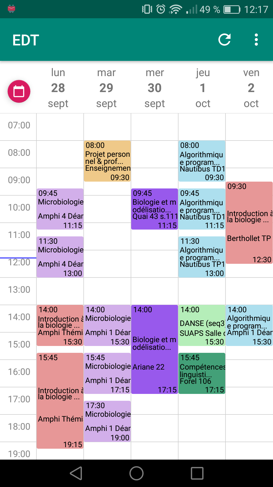

# EDT-Lyon-1
Weekly schedule for Lyon 1 university's ADE

 

Instead of asking the user to generate an URL, a login screen is used to get the resources numbers from HTML inside a WebView.

I use [tobiasschuerg's WeekView](https://github.com/tobiasschuerg/android-week-view) to show the courses, and [kizitonwose's CalendarView](https://github.com/kizitonwose/CalendarView).
